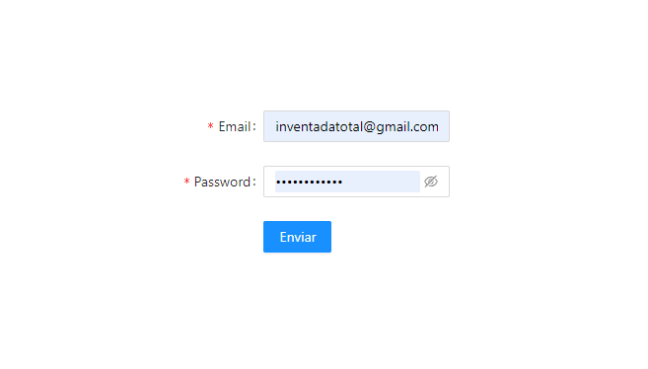

# ONLINE SHOP - FRONTEND

## ÍNDICE

* Sobre el proyecto
    * Instalación y despliegue
    * Tecnologías utilizadas
    * Origen

* Requerimientos

* Estructura de la página

* Documentacion de React

* Rutas

* Retos presentados

* Futura implementaciones

* Agradecimientos

* Autor

## Sobre el proyecto

### Instalación y despliegue

Primero instalamos react con la carpeta que contendrá el proyecto:

```PowerShell
npx create-react-app nombre-aplicacion
```

Una buena idea es instalar esta extensión para acceder a los snippets de React:

https://marketplace.visualstudio.com/items?itemName=dsznajder.es7-react-js-snippets

La siguiente herramienta de desarrollador nos permite ver las jerarquías de los componentes de React:

https://chrome.google.com/webstore/detail/react-developer-tools/fmkadmapgofadoplj
bjfkapdkoienihi?hl=es

Deberemos installar el siguiente paquete para poder crear rutas en nuestros componentes:

```PowerShell
$ npm install react-router-dom@6
```

Instalamos el paquete sass para aplicar reglas anidadas y funciones con variables entre otras cosas:

```PowerShell
$ npm install sass
```

### Tecnologías utilizadas

FrontEnd:
* CSS
* Sass
* Javascript
* React
* React-GlobalContext
* React-Router
* Jquery

BackEnd:
* SQLito
* Sequelize
* Express
* Node.js

### Origen

Este proyecto se propuso como un ejercicio en el [bootcamp de FullStack Development de The Bridge](https://www.thebridge.tech/bootcamps/bootcamp-fullstack-developer) para poner en práctica los conocimientos adquiridos sobre FrontEnd. Consiste en crear una Tienda Online.

## Requerimientos

[X] Registro de usuarios.

[X] Login de usuarios.

[X] Que se puedan ver los productos y añadir al carrito de compra.

[X] Que se pueda crear pedidos.

[X] Que en tu perfil puedas ver tus datos.

[X] Uso de ramas con git, cuando se termine el proyecto deberán quedar dos ramas la master o main y la develop.

[X] Presentación de README excelente.

Componentes mínimos:

    [X] Register

    [X] Login

    [X] Home

    [X] Products

    [X] Product

    [X] Perfil. Vista perfil con los datos del usuario logeado y sus pedidos

    [X] Header

    [X] Footer

Implementa React Router en tu página:

    [X] /home. Home de la app

    [X] /login

    [X] /register

    [X] /profile

[X] Utilizar Context

[X] Uso de SASS

[X] Importante el diseño

## Estructura de la página

Cada ruta construye una página con tres componentes: La cabecera y el pie de página son comunes a todas ellas.

## Rutas

HOME:
* Navbar
* Imagen central
* Footer


PRODUCTS:
* Navbar
* Productos
* Footer

Mostramos en pantalla el resultado de la petición a nuestra base de datos para que nos traiga todos lo productos.


PROFILE:
* Navbar
* Datos personales
* Pedidos
* Footer


CART:
* Navbar
* Productos del carrito
* Footer

Al dar al botón "Comprar" aparece un modal de confirmación (segunda foto).


REGISTER:

* Navbar
* Formulario de registro
* Footer


LOGIN:

* Navbar
* Formulario de LogIn
* Footer



## Documentación de React

https://es.reactjs.org/docs/getting-started.html

## Retos presentados

* Realizar una suma dentro de un map.

* Fluidez a la hora de controlar los estados y sus ciclos de vida.

## Futuras implementaciones:

* Bucadores (por nombre, género musical y formato).

* Filtro por precio.

* Barras de gustos funcionales en Datos personales.

* Vista moderador.

* Favoritos.

* Reviews.

* Cambiar foto de perfil.

* Guards.

* Responsive.

* Confirmación por email.

## Agradecimientos:

Como siempre, a los profes ([Sofía](https://github.com/SofiaPinilla), [Geer](https://github.com/GeerDev) e [Iván](https://github.com/ivanpuebla10)).

A los compis, en especial a [Yorch](https://github.com/Yorch82) y [Vincent](https://github.com/Vincecoorp21) por ayudarnos con el Backend en general, a [David](https://github.com/Dubesor22) por enseñarnos a sumar y a [Mike](https://github.com/MrSetOne) por ayudarnos con el Frontend.

Y, por último a [Miguel](https://github.com/Mik3Tab) por ayudarnos a resolver unos bugs.

## Autores:

[Germán](https://github.com/Molerog) 🐧

[Rebeca](https://github.com/RebecaASuesta) 🐤